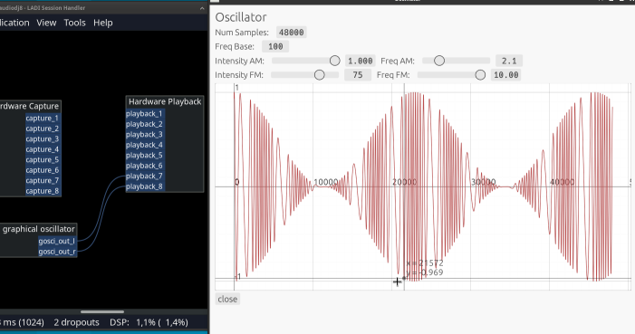

# Info
- generate sine wave with additional amplitude (AM) and frequency modulation (FM)
- possibility to change parameter
- visualize the wave
- learning signal processing
- learning egui

# screenshot


# dependencies
You need JACK Audio Connection Kit and tools like qjackctl (see jackaudio.org)

On Ubuntu, you need to install dependencies:
```
sudo apt-get install jackd libjack-jackd2-dev
```

On Arch Linux:
```
sudo pacman -S jack2
```
or use `pipewire-jack`
and a newer version of cargo:
* tested with cargo 1.61.0

# build
```
cargo build
```

# run
```
cargo run
```

# ToDo
- Add windowing to prevent clipping
- LP,BP,HP filter
- Effects
- put wave generation in extra thread and copy data via ring buffer
- handle wave generation with pool allacoation (no malloc in jack thread)
- add wav-file export
- work with modules and reuseable code
- add configurable Midi setup
  - mostly done, need to put midi handling in seperate crate to reuse
- update GUI with visualization of ADSR

# History
- 20240210 Add Midiconfiguration
- 20221230 velocity sensitive Midi control of tones
- 20221025 polyphon tone generation over midi
- 20220825 add trigger to play sound with envelope
- 20220720 jack sound output is working
- 20220712 first version with visualization of AM and FM

# Troubleshooting
* while building
```
stderr
  thread 'main' panicked at 'called `Result::unwrap()` on an `Err` value: "`\"pkg-config\" \"--libs\" \"--cflags\" \"jack\"` did not exit successfully: exit status: 1\nerror: could not find system library 'jack' required by the 'jack-sys' crate
  ...
```
- got this on Ubuntu because `libjack-dev` or `libjack-jack2-dev` wasn't installed
- with older version of cargo it couldn't found `eframe` > 0.17.0 but version 0.18.0 is required
